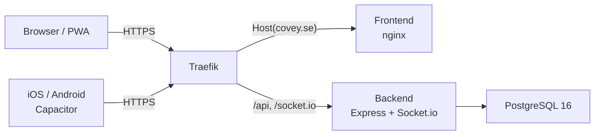

# Architecture

## Overview

Tillsammans is a 4-service stack orchestrated by Docker Compose, with optional native iOS/Android apps via Capacitor:



## Services

| Service | Image | Role | Port |
|---------|-------|------|------|
| **traefik** | `traefik:v3.2` | Reverse proxy, TLS termination (Let's Encrypt), routing | 80, 443 |
| **frontend** | Custom (nginx:1.27-alpine) | Serves Vite-built static assets, SPA fallback | 80 (internal) |
| **backend** | Custom (node:22-alpine) | REST API, Socket.io real-time, auth | 3000 (internal) |
| **db** | `postgres:16-alpine` | Persistent storage | 5432 (internal) |

## Networks

- **web** — Traefik ↔ frontend, Traefik ↔ backend (public-facing)
- **internal** — backend ↔ db, frontend ↔ backend (private)

## Routing (Traefik)

| Rule | Target |
|------|--------|
| `Host(DOMAIN)` | frontend |
| `Host(DOMAIN) && (PathPrefix(/api) \|\| PathPrefix(/socket.io))` | backend |

> **Note**: Traefik v3 only accepts a single argument per `PathPrefix`, so multiple prefixes must be joined with `||`.

TLS configuration is **not** in the base `docker-compose.yml`. Instead, environment-specific overlays control it:

| Overlay file | TLS mode | Usage |
|---|---|---|
| `docker-compose.prod.yml` | Let's Encrypt (ACME) | `docker compose -f docker-compose.yml -f docker-compose.prod.yml up` |
| `docker-compose.local.yml` | Self-signed (Traefik default cert) | `docker compose -f docker-compose.yml -f docker-compose.local.yml up` |

## Data flow

1. **Static assets**: Browser → Traefik → nginx (frontend) → pre-built HTML/JS/CSS
2. **API calls**: Browser → Traefik → Express (backend) → PostgreSQL
3. **Real-time**: Browser → Traefik (sticky sessions) → Socket.io (backend), upgrades from long-polling to WebSocket

## Production Middleware

- **Trust proxy**: `app.set('trust proxy', 1)` — required behind Traefik so Express resolves the real client IP from `X-Forwarded-For` header. Without this, rate limiting (which keys on `req.ip`) would treat all clients as the same IP (Traefik's internal address).
- **Helmet CSP**: Content-Security-Policy is configured explicitly in `index.js` to allow:
  - `img-src`: `'self'` + `https://*.tile.openstreetmap.org` (Leaflet map tiles) + `data:` (inline images)
  - `connect-src`: `'self'` + `wss:` + `ws:` (Socket.io WebSocket connections)
  - `style-src`: `'self'` + `'unsafe-inline'` (Tailwind CSS + Leaflet inline styles)
  - Default helmet CSP blocks all of these, causing map tiles to fail and WebSocket connections to be refused.

## Feature Flag System

Simple env-var-based feature flags. No database, no admin UI, no external service.

| Flag | Default | Purpose |
|------|---------|---------|
| `FEATURE_BANKID_AUTH` | `false` | Use real BankID API vs stub provider |
| `FEATURE_PUSH_NOTIFICATIONS` | `false` | Web Push API vs mock provider |
| `FEATURE_GEOLOCATION` | `false` | Location sharing during sessions |
| `FEATURE_COMMUNITIES` | `false` | Safety communities feature |

Backend reads `FEATURE_*` from process env. Frontend fetches flags via `GET /api/features` on load. Flags change between deployments, not at runtime.

## Authentication Architecture

Provider pattern with two implementations sharing a common interface:

```
AUTH_PROVIDER env var
  ├── "stub"   → Stub provider (always, regardless of feature flag)
  └── "bankid" → FEATURE_BANKID_AUTH=true  → Real BankID provider
                  FEATURE_BANKID_AUTH=false → Stub (with warning log)
```

Both providers implement: `initAuth(pno)`, `collect(orderRef)`, `cancel(orderRef)`.
Tokens are proper JWTs signed with `jose` (HS256). The stub provider simulates realistic BankID behavior with time-based state progression and error simulation.

### Token Validation

JWT tokens carry a `userId` (database UUID) and `sub` (NIN hash). Validation happens at two levels:

1. **`POST /api/auth/verify`** (session restore) — validates JWT signature, checks `userId` is a valid UUID, and confirms the user exists in the database. Stale tokens from previous sessions (e.g., after DB volume recreate) are rejected.
2. **`authenticate` middleware** (all protected routes) — validates JWT signature and rejects tokens where `userId` is not a valid UUID format, preventing invalid-UUID errors from reaching PostgreSQL.

## Notification Architecture

Provider pattern (like auth):

```
FEATURE_PUSH_NOTIFICATIONS env var
  ├── true  → Real provider (web-push library, VAPID keys from env vars)
  │             Falls back to mock if VAPID_PUBLIC_KEY/VAPID_PRIVATE_KEY not set
  └── false → Mock provider (records sent notifications in memory)
```

Real provider uses `webPush.sendNotification()` with VAPID credentials (`VAPID_PUBLIC_KEY`, `VAPID_PRIVATE_KEY`, `VAPID_CONTACT` env vars). The frontend `VITE_VAPID_PUBLIC_KEY` is a build-time arg in `frontend/Dockerfile`, baked into the Vite bundle for subscription creation.

Native push (iOS APNs / Android FCM) uses Firebase Admin SDK via `firebase-admin`. Enabled when `FIREBASE_SERVICE_ACCOUNT` env var is set (JSON service account key). Native tokens stored in `native_push_tokens` table (separate from `push_subscriptions`). Both `notifyNewRequest()` and `notifyRequestAccepted()` send to web and native subscriptions in parallel.

Mock provider exposes `getSentNotifications()` for test assertions and `GET /api/notifications/sent` endpoint. This means tests can verify notification content and delivery without real push infrastructure.

### Request-triggered notifications

When a new assistance request is created (via HTTP `POST /api/requests` or Socket `request:create`), the server sends push notifications to all eligible responders — even if their browser is closed.

```
Request created → notifyNewRequest() [fire-and-forget]
  ├── findEligibleForRequest() — single SQL query:
  │   ├── JOIN push_subscriptions × users × community_members
  │   ├── Eligibility tier filtering (same_demographics / verified_guardians / any_member)
  │   ├── Exclude requester, exclude soft-deleted users
  │   ├── DISTINCT ON (user_id) — 1 subscription per user (most recent)
  │   └── For community-scoped: restrict to approved members
  ├── JS defense-in-depth: deduplicate by user_id + exclude requester
  ├── Localize body per user's preferred_lang (12 languages, hardcoded)
  └── Promise.allSettled() — one failure doesn't block others
```

The notification payload includes `title`, `body`, `url` (`/requests`), and `requestId`. The service worker's existing `push` event handler shows a native OS notification. Clicking it opens/focuses the app at the requests page.

## Community Security Model

Communities are protected against adversarial member targeting:

| Threat | Mitigation |
|--------|------------|
| Enumerate members | Member lists visible to fellow members only. Non-members see name + member count. |
| Scrape community locations | Nearby endpoint returns `area_name` (e.g., "Sodermalm"), NOT lat/lng coordinates. |
| Join communities to surveil | Join requires admin approval. Admins approve/reject requests. |
| Identify real names | Display names are user-chosen pseudonyms. BankID name is NOT auto-populated. |
| Cross-reference users | Profile endpoint returns display name + verified badge only to non-self viewers. |
| Accept requests to approach targets | Audit trail links BankID-verified identities. Safety check-in after session. |

## Assistance Request Lifecycle

```
open ─→ accepted ─→ active ─→ completed ─→ safety_confirmed
  │         │          │
  └─────────┴──────────┴───→ cancelled
  │
  └───→ expired (automatic, 30-minute timeout)
```

Location data is ephemeral — a database trigger purges `location_updates` when a request reaches a terminal state (`completed`, `cancelled`, `expired`).

## Database Schema

All tables are created in a single initial migration (`001_initial`):

- `migrations` — tracks executed migrations
- `users` — BankID-verified users (NIN stored as SHA-256 hash only)
- `communities` — safety communities with geographic center (not exposed to clients)
- `community_members` — join table with approval workflow (`pending` → `approved`)
- `assistance_requests` — the core feature (walk, escort, check_in)
- `location_updates` — ephemeral location data during active sessions
- `push_subscriptions` — Web Push API subscriptions
- `native_push_tokens` — Capacitor iOS (APNs) / Android (FCM) push tokens

## Environment variables

All secrets live in the root `.env` file (never committed). Docker Compose interpolates them into service configs.

| Variable | Used by | Purpose |
|----------|---------|---------|
| `DOMAIN` | Traefik, frontend, backend | Public hostname |
| `ACME_EMAIL` | Traefik | Let's Encrypt registration |
| `POSTGRES_USER` | db, backend | Database credentials |
| `POSTGRES_PASSWORD` | db, backend | Database credentials |
| `POSTGRES_DB` | db, backend | Database name |
| `JWT_SECRET` | backend | JWT signing (HS256 via jose) |
| `CORS_ORIGIN` | backend | Allowed origin for API/Socket.io |
| `AUTH_PROVIDER` | backend | `stub` (default) or `bankid` |
| `FEATURE_BANKID_AUTH` | backend | Enable real BankID (default: `false`) |
| `FEATURE_PUSH_NOTIFICATIONS` | backend | Enable Web Push (default: `false`) |
| `FEATURE_GEOLOCATION` | backend | Enable location sharing (default: `false`) |
| `FEATURE_COMMUNITIES` | backend | Enable communities (default: `false`) |
| `VAPID_PUBLIC_KEY` | backend, frontend (build arg) | Web Push VAPID public key |
| `VAPID_PRIVATE_KEY` | backend | Web Push VAPID private key |
| `VAPID_CONTACT` | backend | VAPID contact email (default: `mailto:sentinel@covey.se`) |
| `FIREBASE_SERVICE_ACCOUNT` | backend | Firebase service account JSON for native push (FCM) |
